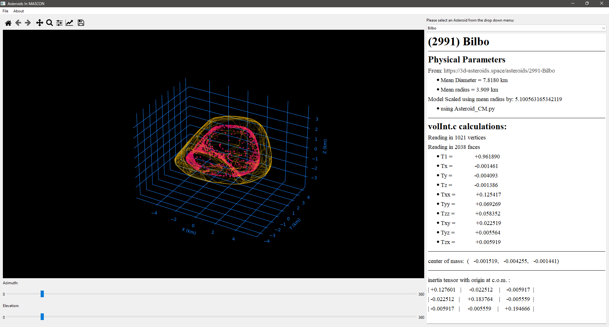

# Asteroids in MASCON
This is the repository for my Engineering Physics Capstone Project. After a successful presentation and submission of this project, I was awarded a Bachelor's in Engineering Physics from the University of Oklahoma!

This software is designed as an educational database of asteroid models, aiming to spread awareness of space sciences and engage society to support National Aeronautics and Space Administration funding. To learn how the MASCON models were created and how the GUI was programmed, see the project report here: [Capstone Paper](Evan_Blosser_Undergrad_Capstone_Paper.pdf)

  

<em>Figure 1. Example caption.</em>

---
---

# HOW TO RUN

There are two ways to run this software: the first is to run it directly, and the second is to install the executable. 

## Run Asteroids in MASCON directly

  The folder `MAIN_GUI` contains all the necessary files; simply run the file `Asteroids_In_MASCON.py`, present within the folder, in your favorite Interactive Development Environment (IDE)!

---

## Installing `Asteroids_In_MASCON`
  The `Asteroids_In_MASCON_Setup.exe` can be downloaded from the "Releases" tab located on the right of this page.
  The current release is **Version_1.3**

  1. Download the `Asteroids_In_MASCON_Setup.exe` file
  2. Locate the file and run as administrator
      - Windows will warn you that I am an Unknown publisher:
        
        
        
      - Simply click **more info** and then **Run anyway**:
        
        
        
3. Next, just follow the setup; you can choose where to install, and if you want a desktop shortcut.

   - I recommend creating the shortcut for ease of locating the software. 

---
---
# Other Software:

## obj2MirtichData.py
  This is a program that can take a .obj file and convert it to a format that can be run inside `volInt.c`

---

### volInt.c
  Created by Brian Mirtich and can be found at:  
  
    https://github.com/OpenFOAM/OpenFOAM-2.1.x/blob/master/src/meshTools/momentOfInertia/volumeIntegration/volInt.c 

---

## Asteroid_CM

  A universal software developed to process shape models in OBJ format. Returns a file of positional data of each calculated Center of Mass for the tetrahedrons that make the polyhedron shape model. 

  This also has a method for scaling the shape model using a mean radius, which can either be a user input, or you can select to not scale the shape model. 

---

## Apophis Recreation

  Contains preliminary work on the asteroid model Apophis to calculate the center of mass for each tetrahedron within the polyhedron shape model (.obj file).

---

## Mean_Radius_Calculations.ipynb

  Contains a log of mean radius and scaling done for all asteroids within this project, as well as the calculations for the mean radius for Arrokoth.
